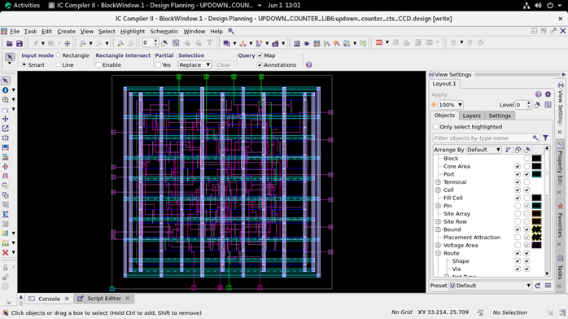

# ASIC Physical Design: 16-bit Up/Down Counter

##  Overview
This repository contains the complete RTL-to-GDSII implementation of a 16-bit up/down counter. The project demonstrates a full ASIC physical design flow, moving from behavioral Verilog code through synthesis, placement, routing, and sign-off analysis using industry-standard Synopsys EDA tools.

##  Tools Used
* **Simulation & Debug:** Synopsys VCS & Verdi
* **Logic Synthesis:** Synopsys Design Compiler (DC)
* **Place & Route (PnR):** Synopsys IC Compiler II (ICC2)
* **Static Timing Analysis (STA):** Synopsys PrimeTime (PT)
* **Hardware Description Language:** Verilog

##  Design Flow Implemented
1. **RTL Design & Verification:** Developed the 16-bit counter and verified functionality via testbenches.
2. **Logic Synthesis:** Mapped RTL to standard cells and generated the gate-level netlist.
3. **Floorplanning & Power Planning:** Defined core area, placed pins, and created the power grid (VDD/VSS rings and stripes).
4. **Placement:** Placed standard cells while optimizing for timing and congestion.
5. **Clock Tree Synthesis (CTS):** Built the clock distribution network to minimize skew and insertion delay.
6. **Routing:** Routed signal nets and resolved DRC violations.
7. **Sign-off:** Performed timing analysis to ensure zero setup/hold violations.

##  Results & Visuals
###  Technical Documentation
For a comprehensive breakdown of the design constraints, synthesis results, and final physical verification (DRC/LVS), please refer to the full project report:
[Download Technical Report (PDF)](REPORT.pdf)
### Final Layout
  
* **Timing:** Met target frequency with positive setup and hold slack = 0.23.
* **Area:** 143.08
* **Power:** 6.81e+08 pW 
